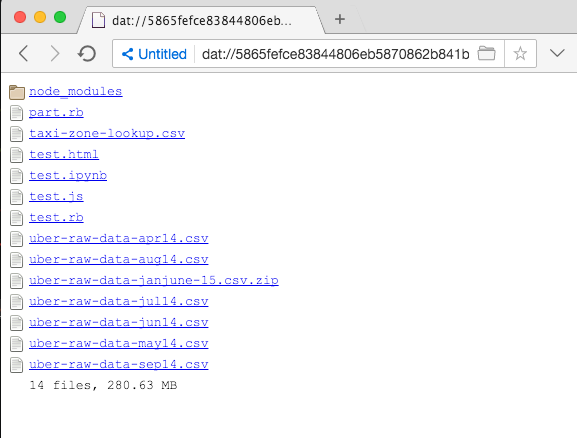

## Web Hosting with dat

1. Install Dat

    npm install -g dat

2. Host your static website with dat

    dat path/to/website

3. Install [Beaker Browser](http://beakerbrowser.com)

4. Open link with Beaker

